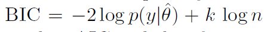

## Why model selection?

<br>

> * Nested models: how much complexity is necessary to fit the data?

> * Non nested models: compare fit of different models

>   * (Note that building a larger model may be better than choosing any one of them!)

<br>

> * Larger models usually fit data better

> * Models usually perform much worse with independent data than with observed (calibration) data

> * Need to account for model complexity (overfitting)


--- &twocol

## Overfitting and balanced model complexity


```{r echo=FALSE}
opts_chunk$set(comment=NA, fig.width=4, fig.height=4, fig.align='center', size='small')
```


*** left

```{r echo=FALSE}
x <- seq(1:10)
y <- rnorm(10, 2 + 0.2*x, 0.3)
```


```{r echo=FALSE}
m1 <- lm(y~x)
plot(x,y, las=1, pch=19)
abline(m1, lwd=2, col="red")
```

```{r echo=FALSE, warning=FALSE, message=FALSE}
require(gam)
require(visreg)
m2 <- gam(y~s(x, df=10))
visreg(m2, line.par=list(col="red", lwd=2))
points(x,y, pch=19)
```


*** right

```{r echo=FALSE}
y2 <- rnorm(10, 2 + 0.8*x - 0.08*x^2, 0.3)
m3 <- lm(y2~x)
plot(x, y2, las=1, pch=19)
abline(m3, col="red", lwd=2)
```


--- &twocol

## An example with machine learning


<br>

Wenger & Olden 2012 Methods Ecol Evol

<br>

*** left


*** right


---

## Evaluating models' predictive accuracy

<br>

* Cross-validation (k fold, leave one out...)

<br>

> * Alternatives:
    * AIC
    * BIC
    * DIC
    * WAIC

> * All these attempt an impossible task: 
      * estimating out-of-sample prediction error without external data or further model fits!

> * All these methods have flaws!


---

## Cross-validation

<br>

Preferred method, but

>  * Requires splitting data (difficult for structured data: space, time)
>  * Data may not be independent (e.g. due to spatial or temporal autocorrelation)
>  * Computationally expensive (requires fitting many models)


---

## AIC

<br>


* First term: model fit (deviance - log likelihood)
* k: number of estimated parameters (penalisation for model complexity)

> * Doesn't work with hierarchical models or informative priors!


---

## DIC


<br>


* First term: posterior deviance (Bayesian)
*  effective number of parameters 
    * (influenced by priors and the amount of pooling in hierarchical models)


---

## WAIC

<br>

* Similar (but not the same) structure as AIC, DIC
* Quite new (2010) and promising
* Fully Bayesian: using posterior distribution rather than point estimate (AIC, DIC)
* But requires splitting data 


---

## What about BIC?

* (misleading name)

<br>



* Larger penalty with large datasets (favouring simpler models)

> * Not intended for assessing out-of-sample model performance
> * Problematic


---

## Final thoughts

<br>
<br>

> * No information criteria is panacea: all have problems
> * They give average out-of-sample prediction error, but prediction errors can differ substantially within the same dataset (e.g. populations, species)
> * Sometimes better models rank poorly. So, combine with thorough model checks
> * Use small set of biologically meaningful candidate models: model selection procedure can strongly overfit the data


--- 

## Conclusions

<br>
<br>

> * AIC not designed for hierarchical models or prior information
> * DIC widely used, but still has some flaws and can fail [not included in STAN]
> * WAIC attractive, but still not easily applicable
> * Use cross-validation whenever possible


---

## To read more

<br>


<br>


---

## END

<br>

I hope it was useful!


