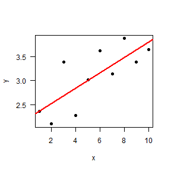
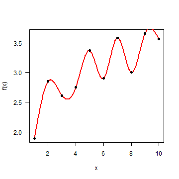
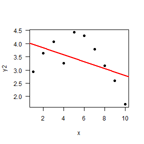

## Why model selection?

 

> * Nested models: how much complexity is necessary to fit the data?

> * Non nested models: compare fit of different models

>   * (Note that building a larger model may be better than choosing any one of them!)

 

> * Larger models usually fit data better

> * Models usually perform much worse with independent data than with observed (calibration) data

> * Need to account for model complexity (overfitting)

--- &twocol

## Overfitting and balanced model complexity

*** left

*** right

--- &twocol

## An example with machine learning

Wenger & Olden 2012 Methods Ecol Evol

*** left

*** right

---

## Evaluating models' predictive accuracy

> * Cross-validation (k fold, leave one out...)

> * Alternatives:
    * AIC
    * BIC
    * DIC
    * WAIC

> * All these attempt an impossible task: 
      * estimating out-of-sample prediction error without external data or further model fits!

> * All these methods have flaws!

---

## Cross-validation

**Preferred** method, but

>  * Requires splitting data (difficult for structured data: space, time)
>  * Data may not be independent (e.g. due to spatial or temporal autocorrelation)
>  * Computationally expensive (requires fitting many models)

---

## AIC

* First term: model fit (deviance - log likelihood)
* k: number of estimated parameters (penalisation for model complexity)

> * Doesn't work with hierarchical models or informative priors!

---

## DIC

* First term: posterior deviance (Bayesian)
*  effective number of parameters 
    * (influenced by priors and the amount of pooling in hierarchical models)

---

## WAIC

* Similar (but not the same) structure as AIC, DIC
* Quite new (2010) and promising
* Fully Bayesian: using posterior distribution rather than point estimate (AIC, DIC)
* But requires splitting data 

---

## What about BIC?

* Misleading name

* Larger penalty with large datasets (favouring simpler models)

> * Not intended for assessing out-of-sample model performance
> * Problematic

---

## Final thoughts

> * No information criteria is panacea: all have problems
> * They give average out-of-sample prediction error, but prediction errors can differ substantially within the same dataset (e.g. populations, species)
> * Sometimes better models rank poorly. So, combine with thorough model checks
> * Use small set of biologically meaningful candidate models: model selection procedure can strongly overfit the data

--- 

## Conclusions

> * AIC not designed for hierarchical models or prior information
> * DIC widely used, but still has some flaws and can fail. Not included in STAN
> * WAIC attractive, but still not easily applicable
> * Use cross-validation whenever possible

---

## To read more

---

## END: hope it was useful!
